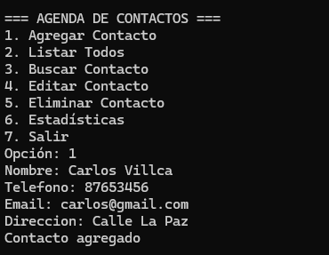
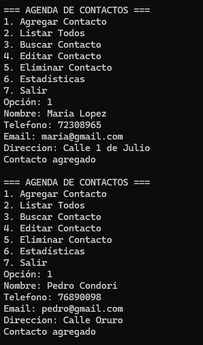
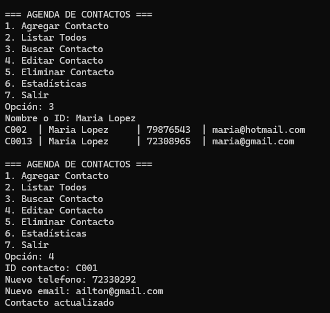
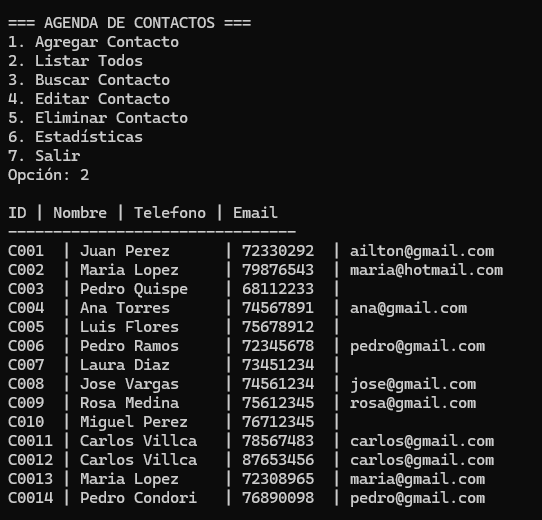

# Agenda de Contactos - Semana 5

## 1. Descripción del sistema
Este proyecto implementa una agenda de contactos en consola desarrollada en Java utilizando Maven.  
El sistema permite agregar, listar, buscar y eliminar contactos, además de mostrar estadísticas.  
También aplica validaciones de datos mediante excepciones personalizadas para evitar información inválida.

---

## 2. Formato JSON utilizado
El programa utiliza un archivo llamado contactos.json para almacenar los contactos.  
Cada contacto se guarda como un objeto JSON con los siguientes campos:

- id
- nombre
- telefono
- email
- direccion

Ejemplo del archivo contactos.json:

[
  {
    "id": "C001",
    "nombre": "Juan Perez",
    "telefono": "72345678",
    "email": "juan@gmail.com",
    "direccion": "Calle Sucre 10"
  },
  {
    "id": "C002",
    "nombre": "Maria Lopez",
    "telefono": "79876543",
    "email": "maria@hotmail.com",
    "direccion": "Av. Aroma 45"
  }
]

Este formato permite guardar y recuperar los contactos fácilmente desde el programa.

---

## 3. Excepciones personalizadas

| Excepción | Cuándo se lanza | Tipo |
|-----------|----------------|------|
| DatoInvalidoException | Cuando el teléfono no tiene entre 7 y 8 dígitos o el email no tiene formato válido | Unchecked (RuntimeException) |

Ejemplo de validación:

Telefono: 123  
Error: Dato invalido en 'telefono': debe tener entre 7 y 8 digitos

---

## 4. Instalación y ejecución con Maven

Requisitos:
- Java JDK 17 o superior
- Maven instalado

Compilar el proyecto:

mvn compile

Ejecutar el programa:

mvn exec:java "-Dexec.mainClass=Main"

---

## 5. Capturas de pantalla del programa

---

---

---
