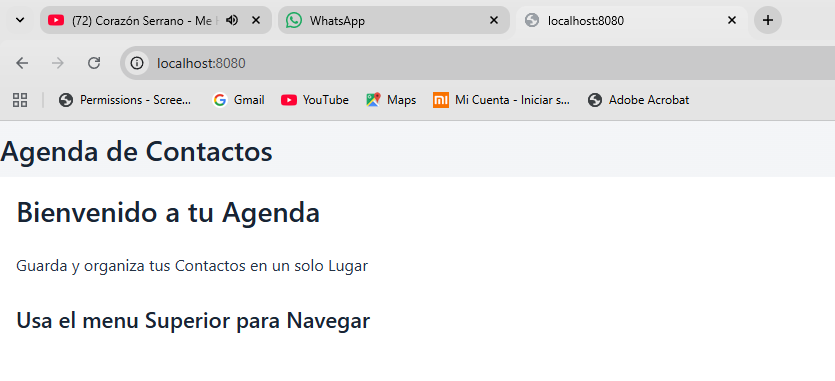
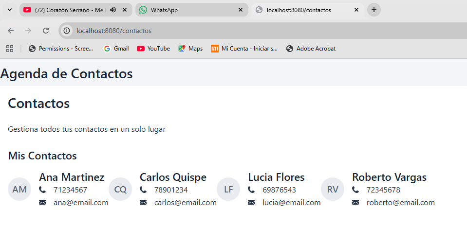

#  Agenda de Contactos

## 1.- Descripción
Esta aplicación web permite gestionar una agenda de contactos de manera sencilla y organizada. El usuario puede visualizar contactos en forma de tarjetas y navegar entre diferentes vistas. Está desarrollada utilizando Vaadin y Spring Boot para ofrecer una interfaz moderna e interactiva.

---

## 2.- Componentes utilizados

- *AppLayout*: Define la estructura principal de la aplicación con barra de navegación superior.
- *MenuBar*: Permite navegar entre las vistas de Inicio y Contactos.
- *VerticalLayout*: Organiza los elementos en forma vertical dentro de las vistas.
- *HorizontalLayout*: Se utiliza para distribuir las tarjetas de contactos horizontalmente.
- *Div*: Contenedor flexible usado para estructurar secciones como el footer.
- *H2 / H3 / Paragraph / Span*: Componentes de texto para títulos, subtítulos y descripciones.

---

## 3.- Cómo ejecutar el proyecto

Ejecuta el siguiente comando en la raíz del proyecto:

mvn spring-boot:run

---

## 4.- Capturas de Pantalla

VISTA INICIO

VISTA CONTACTOS

