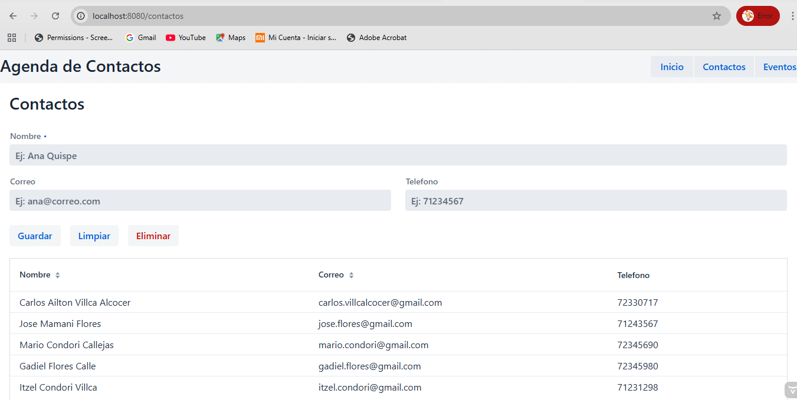
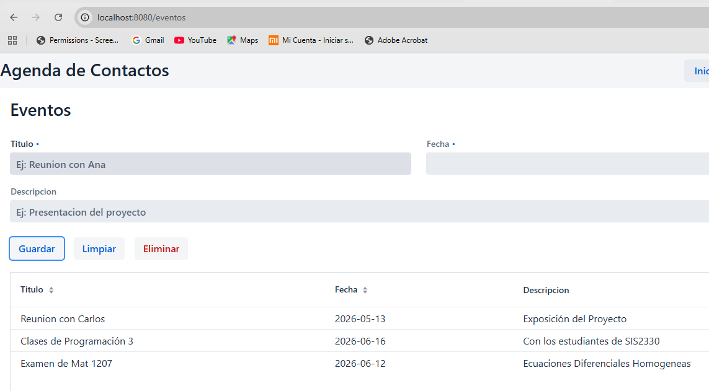

# Semana 10 — Agenda Web Completa con Vaadin

## 1.-Descripción del proyecto

Este proyecto es una aplicación web desarrollada con Java, Spring Boot y Vaadin que permite administrar contactos y eventos desde una interfaz gráfica en el navegador.  
La aplicación implementa CRUD completo para ambas entidades, incluyendo creación, edición, eliminación y visualización mediante Grid<T>.  
Los datos se almacenan en archivos JSON utilizando una arquitectura en capas basada en Vista → Service → ManejadorJSON → Archivo JSON.  
Además, el sistema utiliza componentes modernos de Vaadin como Binder, ConfirmDialog y DatePicker para mejorar la experiencia del usuario.

---

## 2.-Diagrama ASCII de arquitectura

text
          ContactosView               EventosView
                 |                           |
                 v                           v
         ContactoService             EventoService       <- @Service
                 |                           |
                 v                           v
            ManejadorJSON              ManejadorJSON
                 |                           |
                 v                           v
          contactos.json              eventos.json

---

## 3.-Flujo de datos del sistema

La aplicación utiliza una arquitectura en capas para separar responsabilidades y mantener el código organizado.

## Flujo general

text
Vista → Service → ManejadorJSON → JSON

## Explicación

a).-Vista (Views)

Las vistas ContactosView y EventosView representan la interfaz gráfica que utiliza el usuario desde el navegador.

Aquí se encuentran:

- Formularios
- Grid<T>
- Botones
- Binder
- ConfirmDialog
- DatePicker

Cuando el usuario guarda o elimina información, la vista llama al servicio correspondiente.

---

b).-Service

Las clases ContactoService y EventoService contienen la lógica de negocio.

Estas clases:

- Obtienen listas
- Guardan registros
- Eliminan registros
- Filtran información
- Actualizan los JSON

Los servicios están anotados con:

java
@Service

para que Spring Boot pueda inyectarlos automáticamente.

---

 c).-ManejadorJSON

ManejadorJSON.java se encarga de:

- Leer archivos JSON
- Convertir JSON a objetos Java
- Guardar listas de objetos en JSON

Utiliza la librería Gson para serializar y deserializar datos.

---

 d).-Archivos JSON

Los datos finalmente se almacenan en:

text
contactos.json
eventos.json

La persistencia permite que la información sobreviva incluso después de cerrar la aplicación.

---

## 4.-Cómo ejecutar el proyecto

 a).-Abrir terminal en la carpeta del proyecto

bash
cd semana-10-agenda-web

 b).-Ejecutar Spring Boot

bash
mvn spring-boot:run

 c).-Abrir el navegador

text
http://localhost:8080

---

## 5.-Capturas de pantalla

 Vista Contactos

---

Vista Eventos

---

## 6.-Ejemplo de 
Contactos.json

json
[
  {
    "nombre": "Carlos Mamani",
    "email": "carlos@correo.com",
    "telefono": "77777777"
  },
  {
    "nombre": "Ana Quispe",
    "email": "ana@correo.com",
    "telefono": "71234567"
  }
]

---

Eventos.json

json
[
  {
    "titulo": "Reunion con equipo",
    "fecha": "2025-06-15",
    "descripcion": "Revision del proyecto final"
  },
  {
    "titulo": "Exposicion final",
    "fecha": "2025-06-20",
    "descripcion": "Presentacion del sistema"
  }
]

---
